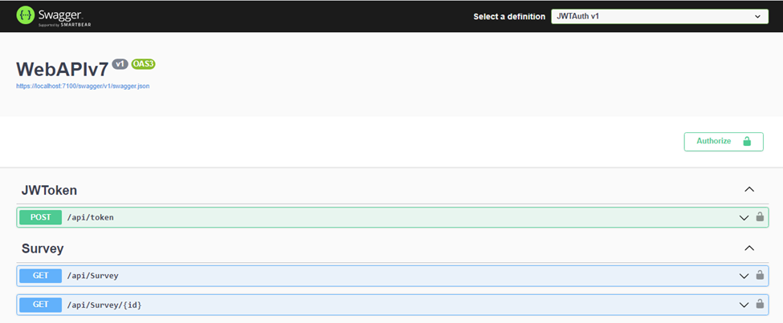
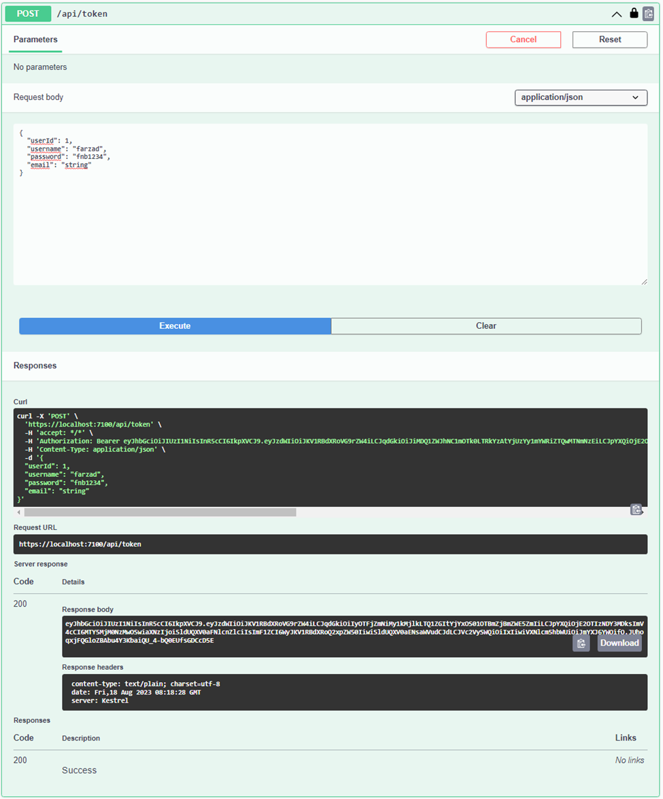
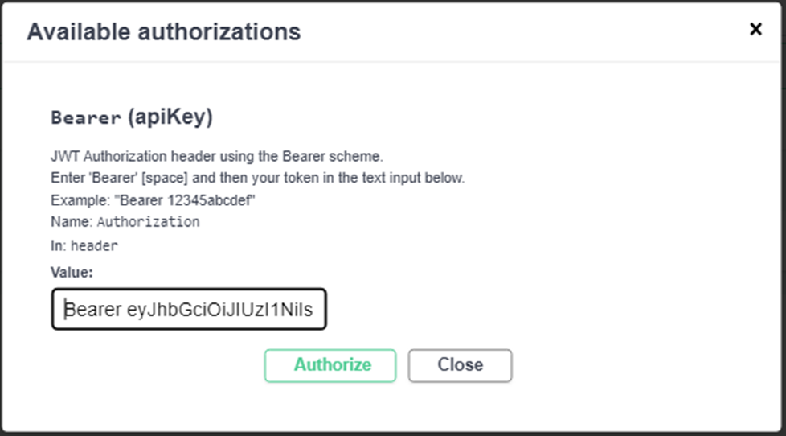
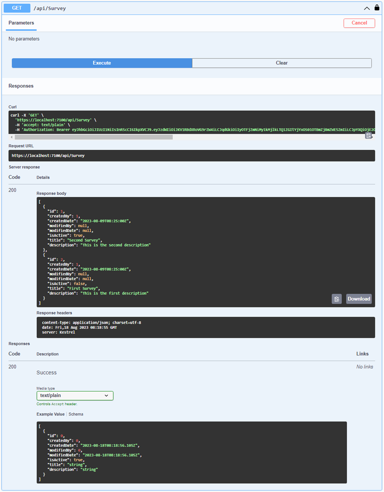
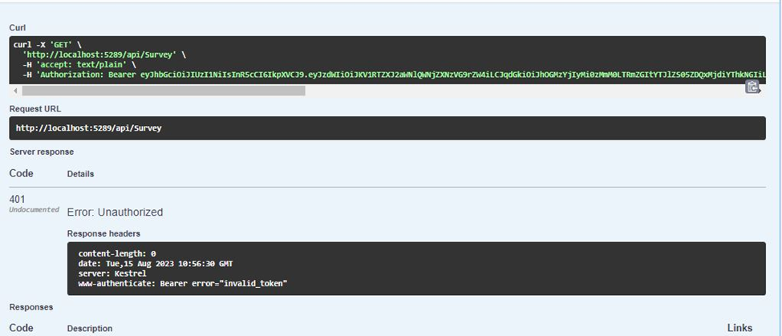

# Install Package
```
Microsoft.EntityFrameworkCore
Microsoft.EntityFrameworkCore.Design
Npgsql.EntityFrameworkCore.PostgreSQL
Microsoft.IdentityModel.Tokens
Microsoft.AspNetCore.Authentication.JwtBearer
```

# Configuration JWT in Swagger .NET CORE 7
```c#
    builder.Services.AddAuthentication(optiones =>
            {
                optiones.DefaultAuthenticateScheme = 
                         JwtBearerDefaults.AuthenticationScheme;
                optiones.DefaultChallengeScheme = JwtBearerDefaults.AuthenticationScheme;
                optiones.DefaultScheme = JwtBearerDefaults.AuthenticationScheme;
            })
            .AddJwtBearer(o =>
            {
                o.TokenValidationParameters = new TokenValidationParameters
                {
                    ValidAudience = builder.Configuration["JwtSecurityToken:Audience"],
                    ValidIssuer = builder.Configuration["JwtSecurityToken:Issuer"],
                    IssuerSigningKey = new SymmetricSecurityKey
                    (Encoding.UTF8.GetBytes(builder.Configuration["JwtSecurityToken:Key"])),
                    ValidateIssuer = true,
                    ValidateAudience = true,
                    ValidateIssuerSigningKey = true,
                    ValidateLifetime = true,
                    ClockSkew = TimeSpan.Zero,
                };
            });
```

## Implementasi Testing API SWAGGER


## Implementasi Login Untuk Mendapatkan Token


## Implementasi Token Yang Berhasil Di Generate


## Implementasi Hit Endpoint Lain dengan menggunakan token sebagai HTTP Header


## Jika Token Valid & Response Success


## Jika Token Tidak Valid & Response Unauthorized

